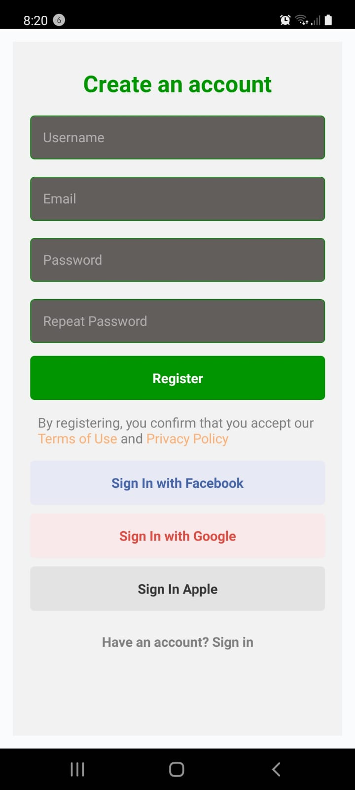
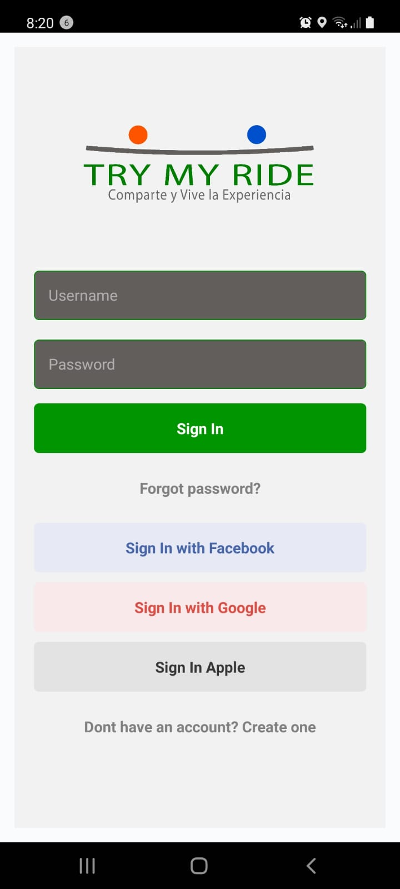
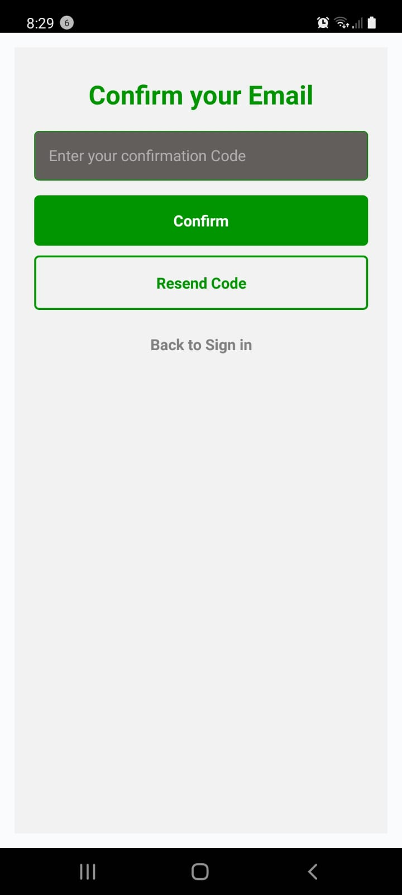
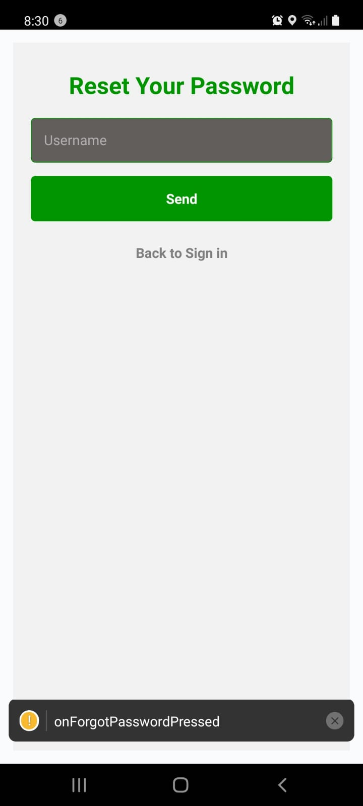
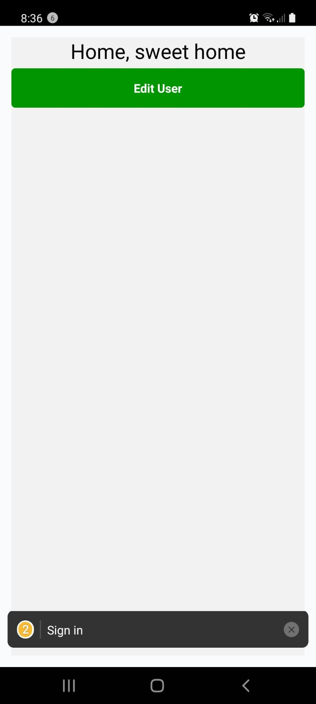

# TryMyRideApp

**App de registro e inicio de sesion con React Native**

**instalacion**

Luego de clonar el repo, toca descargar las dependencias -->> npm i,
para el backend debes tener instalados los siguientes programas:

<ul>
  <li>COMPOSER</li>
  <li>PHP</li>
  <li>XAMMP CONTROL PANEL</li>
  <li>LARAVEL</li>
  <li>ARTISAN</li>
</ul>

encontraras una carpeta llamada **TryMyRide-Backend** 
corta y pega esta carpeta en : C:\xampp\htdocs o donde se encuentre tu carpeta xampp/htdocs

te posicionaras sobre la carpeta crudtrymyride
y ya podras correr el back con el comando : php artisan serve

en esta aplicacion podras notar que es un formulario completo de registro, con todos los posibles registros disponibles

**Logins con:**
<ul>
  <li>Facebook</li>
  <li>Google</li>
  <li>Apple</li>
  <li>Confirmacion de Correo</li>
  <li>Recuperar contraseña</li>
</ul>

con una navegacion a todos los botones, y enlazando las politicas de uso a la pagina de la empresa original
de momento funcional solo el registro y el login

